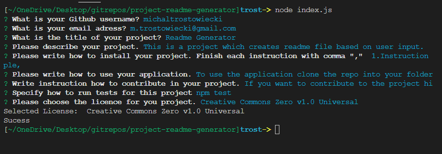

# Readme Generator

## Description

This project allow the user to create readme.md file based on user input. File is automaticaly created once all the questions are answered.

## Technologies Used

Javascript, Node, inquirer.

## Installation

1. Clone repo to your local desktop/laptop.
2. Install node from this link: https://nodejs.org/en.
3. In your freshly cloned folder open terminal and type in command line `npm install`
4. Next run command `node index.js`
5. Follow instructions from your command line.
6. Once all questions are answered Readme.md file will be auto generated.

## Screenshot

## Credits

N/A

## License

This project is licensed under the MIT License - see the [LICENSE](LICENSE) file for details.